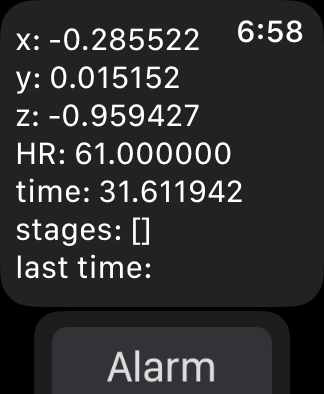
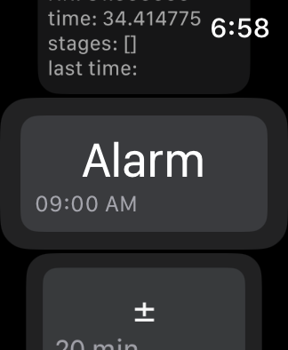
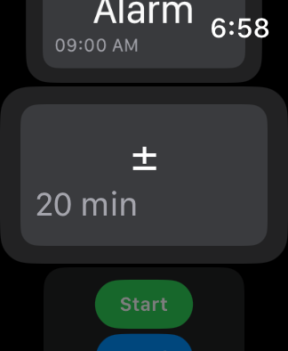

# Smart Sleep Cycle Alarm Clock

This project is a "smart alarm" application designed to wake users up during their lightest sleep phase, ensuring they feel refreshed. It consists of a Swift-based iOS/watchOS app and a Python backend powered by machine learning.

## How It Works

1.  **Set Alarm**: In the iOS/watchOS app, the user sets a target wake-up time and a "wake-up window" (e.g., +/- 20 minutes).
2.  **Data Collection**: The Apple Watch collects real-time accelerometer (motion) and heart rate data while the user sleeps.
3.  **Sleep Analysis**: The app pings the Python API with this sensor data.
4.  **Prediction**: The backend processes the data and uses a trained machine learning model (Random Forest) to predict the current sleep stage.
5.  **Smart Wake-Up**:
    *   If the user is in **light sleep** during the wake-up window, the alarm triggers.
    *   If the window expires, the alarm triggers normally to prevent oversleeping.

## Project Components

*   **Swift App (`swiftyyyy/`)**: A SwiftUI application for iPhone and Apple Watch. It handles the user interface for alarm settings and utilizes Core Motion and HealthKit for data collection.
*   **Backend API (`api stuff/`)**: A Python server that receives data from the watch, runs it through the processing pipeline, and returns sleep stage predictions.
*   **Machine Learning (`postprocessing/`, `source/`)**: Scripts and notebooks for training the sleep classification models. It includes data preprocessing, feature extraction, and model evaluation.

## App Interface

|  |  |  |  |
|:---:|:---:|:---:|:---:|
| **Real-time Sensor Data** Live accelerometer & HR data. | **Alarm Setup** Set wake-up time. | **Wake-up Window** Adjust wake-up window. | **Controls** Start/Stop tracking and alarm. |

## Credit

This was built off the work done in this [paper](https://academic.oup.com/sleep/article/42/12/zsz180/5549536)
